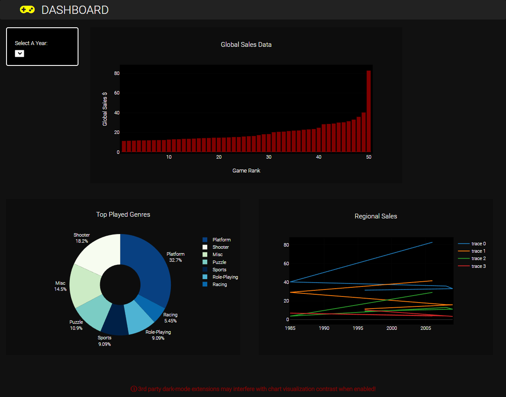

<!-- README START -->

<!-- HEADER -->

# Video-Game-Sales-Dashboard

---

<!-- ABOUT PROJECT -->

## About

---

This is a Data Visualization Dashboard built with a collection of technology. Flask, Python, Javascript, Plotly, SQL and much more were used to create this application.

<!-- TECH/TOOLS  -->

## Technology

---

<p align="center">
  
  
  
  
  
  
  
  
  
  
</p>

<!-- ABOUT FLASK -->

</br>

## Flask App

---

A dashboard web app developed with [Flask](https://palletsprojects.com/p/flask/) framework.

The main purpose is to introduce how to implement the essential elements in web application with Flask, including

- URL Building

- Authentication with Sessions

- Template & Template Inheritance

- Error Handling

- Integrating with _Bootstrap_

- Interaction with Database

- Invoking static resources

For more basic knowledge of Flask, you can refer to the documenration here: [documentation](https://flask.palletsprojects.com/en/2.0.x/).

<!-- HOW TO RUN APPLICATION LOCALLY -->

</br>

## How to Run

---

- Step 1: Make sure you have Python

- Step 2: Install the requirements: `pip install -r requirements.txt`

- Step 3: Go to this app's directory and run `python app.py`

- Step 4: Visit applications local URL: http://localhost:5000/

<!-- PROJECT DIRECTORY STRUCTURE -->

</br>

## Directory Structure

---

```
Video-Games-Sales-Dashboard
|   .gitignore
|   README.md
|   requirements.txt
|
+---app
|   |   app.py
|   |   scraper.py
|   |
|   +---static
|   |   +---css
|   |   |       style.css
|   |   |
|   |   +---img
|   |   |
|   |   \---js
|   |           script.js
|   |
|   +---templates
|   |       index.html
|   |
\---code
    +---csv
    |       clean_vgsales.csv
    |
    \---sql
            -- SQL_games_data.sql
            sql_connection.ipynb

```

<!-- WIP SS -->
<!-- will update as we go -->

## UI Idea

---

</br>


